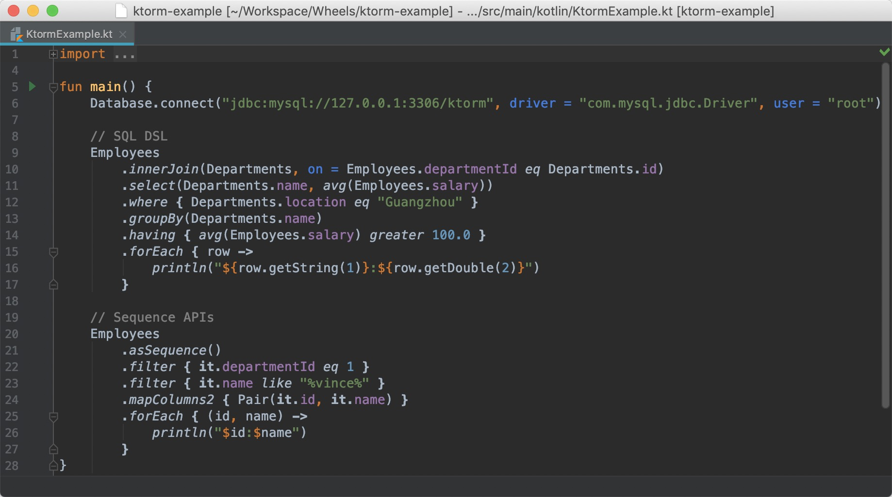

<p align="center">
    
</p>
<p align="center">
    <a href="https://www.travis-ci.org/vincentlauvlwj/Ktorm">
        
    </a>
    <a href="https://search.maven.org/search?q=g:%22me.liuwj.ktorm%22">
        
    </a>
    <a href="LICENSE">
        
    </a>
    <a href="https://app.codacy.com/app/vincentlauvlwj/Ktorm?utm_source=github.com&utm_medium=referral&utm_content=vincentlauvlwj/Ktorm&utm_campaign=Badge_Grade_Dashboard">
        
    </a>
    <a href="https://github.com/KotlinBy/awesome-kotlin">
        
    </a>
</p>


# What's Ktorm?

Ktorm is a lightweight and efficient ORM Framework for Kotlin directly based on pure JDBC. It provides strong-typed and flexible SQL DSL and convenient sequence APIs to reduce our duplicated effort on database operations. All the SQLs, of course, are generated automatically. Ktorm is open source under the license of Apache 2.0. Leave your star if it's helpful to you. 

For more documentation, go to our site: [https://ktorm.liuwj.me](https://ktorm.liuwj.me).

:us: English | :cn: [简体中文](README_cn.md)

# Features

 - No configuration files, no XML, no third-party dependencies, lightweight, easy to use.
 - Strong typed SQL DSL, exposing low-level bugs at compile time.
 - Flexible queries, fine-grained control over the generated SQLs as you wish.
 - Entity sequence APIs, writing queries via sequence functions such as `filter`, `map`, `sortedBy`, etc., just like using Kotlin's native collections and sequences. 
 - Extensible design, write your own extensions to support more operators, data types, SQL functions, database dialects, etc.

<p align="center">
    
</p>

# Quick Start

Ktorm was deployed to maven central and jcenter, so you just need to add a dependency to your `pom.xml` file if you are using maven: 

````xml
<dependency>
    <groupId>me.liuwj.ktorm</groupId>
    <artifactId>ktorm-core</artifactId>
    <version>${ktorm.version}</version>
</dependency>
````

Or Gradle: 

````groovy
compile "me.liuwj.ktorm:ktorm-core:${ktorm.version}"
````

Firstly, create Kotlin objects to [describe your table schemas](https://ktorm.liuwj.me/en/schema-definition.html): 

````kotlin
object Departments : Table<Nothing>("t_department") {
    val id by int("id").primaryKey()
    val name by varchar("name")
    val location by varchar("location")
}

object Employees : Table<Nothing>("t_employee") {
    val id by int("id").primaryKey()
    val name by varchar("name")
    val job by varchar("job")
    val managerId by int("manager_id")
    val hireDate by date("hire_date")
    val salary by long("salary")
    val departmentId by int("department_id")
}
````

Then, connect to your database and write a simple query: 

````kotlin
fun main() {
    Database.connect("jdbc:mysql://localhost:3306/ktorm", driver = "com.mysql.jdbc.Driver")

    for (row in Employees.select()) {
        println(row[Employees.name])
    }
}
````

Now you can run this program, Ktorm will generate a SQL `select * from t_employee`, selecting all employees in the table and printing their names. You can use the for-each loop because the query object returned by the `select` function implements the `Iterable<T>` interface. Any other extension functions on `Iterable<T>` are also available, eg. map/filter/reduce provided by Kotlin standard lib.

## SQL DSL

Let's add some filter conditions to the query: 

````kotlin
val names = Employees
    .select(Employees.name)
    .where { (Employees.departmentId eq 1) and (Employees.name like "%vince%") }
    .map { row -> row[Employees.name] }
println(names)
````

Generated SQL: 

````sql
select t_employee.name as t_employee_name 
from t_employee 
where (t_employee.department_id = ?) and (t_employee.name like ?) 
````

That's the magic of Kotlin, writing a query with Ktorm is easy and natural, the generated SQL is exactly corresponding to the origin Kotlin code. And moreover, it's strong-typed, the compiler will check your codes before it runs, and you will be benefited from the IDE's intelligent sense and code completion.

Dynamic query based on conditions: 

```kotlin
val names = Employees
    .select(Employees.name)
    .whereWithConditions {
        if (someCondition) {
            it += Employees.managerId.isNull()
        }
        if (otherCondition) {
            it += Employees.departmentId eq 1
        }
    }
    .map { it.getString(1) }
```

Aggregation: 

```kotlin
val t = Employees
val salaries = t
    .select(t.departmentId, avg(t.salary))
    .groupBy(t.departmentId)
    .having { avg(t.salary) greater 100.0 }
    .associate { it.getInt(1) to it.getDouble(2) }
```

Union: 

```kotlin
Employees
    .select(Employees.id)
    .unionAll(
        Departments.select(Departments.id)
    )
    .unionAll(
        Departments.select(Departments.id)
    )
    .orderBy(Employees.id.desc())
```

Joining: 

```kotlin
data class Names(val name: String, val managerName: String?, val departmentName: String)

val emp = Employees.aliased("emp")
val mgr = Employees.aliased("mgr")
val dept = Departments.aliased("dept")

val results = emp
    .leftJoin(dept, on = emp.departmentId eq dept.id)
    .leftJoin(mgr, on = emp.managerId eq mgr.id)
    .select(emp.name, mgr.name, dept.name)
    .orderBy(emp.id.asc())
    .map {
        Names(
            name = it.getString(1),
            managerName = it.getString(2),
            departmentName = it.getString(3)
        )
    }
```

Insert: 

```kotlin
Employees.insert {
    it.name to "jerry"
    it.job to "trainee"
    it.managerId to 1
    it.hireDate to LocalDate.now()
    it.salary to 50
    it.departmentId to 1
}
```

Update: 

```kotlin
Employees.update {
    it.job to "engineer"
    it.managerId to null
    it.salary to 100

    where {
        it.id eq 2
    }
}
```

Delete: 

```kotlin
Employees.delete { it.id eq 4 }
```

Refer to [detailed documentation](https://ktorm.liuwj.me/en/query.html) for more usages about SQL DSL.

## Entities and Column Binding

In addition to SQL DSL, entity objects are also supported just like other ORM frameworks do. We need to define entity classes firstly and bind table objects to them. In Ktorm, entity classes are defined as interfaces extending from `Entity<E>`: 

````kotlin
interface Department : Entity<Department> {
    val id: Int
    var name: String
    var location: String
}

interface Employee : Entity<Employee> {
    val id: Int?
    var name: String
    var job: String
    var manager: Employee?
    var hireDate: LocalDate
    var salary: Long
    var department: Department
}
````

Modify the table objects above, binding database columns to entity properties:  

````kotlin
object Departments : Table<Department>("t_department") {
    val id by int("id").primaryKey().bindTo { it.id }
    val name by varchar("name").bindTo { it.name }
    val location by varchar("location").bindTo { it.location }
}

object Employees : Table<Employee>("t_employee") {
    val id by int("id").primaryKey().bindTo { it.id }
    val name by varchar("name").bindTo { it.name }
    val job by varchar("job").bindTo { it.job }
    val managerId by int("manager_id").bindTo { it.manager.id }
    val hireDate by date("hire_date").bindTo { it.hireDate }
    val salary by long("salary").bindTo { it.salary }
    val departmentId by int("department_id").references(Departments) { it.department }
}
````

> Naming Strategy: It's highly recommended to name your entity classes by singular nouns, name table objects by plurals (eg. Employee/Employees, Department/Departments). 

Now that column bindings are configured, so we can use those convenient extension functions for entities. For example, finding an employee by name: 

```kotlin
val vince = Employees.findOne { it.name eq "vince" }
println(vince)
```

The `findOne` function accepts a lambda expression, generating a select sql with the condition returned by the lambda, auto left joining the referenced table `t_department` . Generated SQL: 

````sql
select * 
from t_employee 
left join t_department _ref0 on t_employee.department_id = _ref0.id 
where t_employee.name = ?
````

Some other `find*` functions: 

```kotlin
Employees.findAll()
Employees.findById(1)
Employees.findListByIds(listOf(1))
Employees.findMapByIds(listOf(1))
Employees.findList { it.departmentId eq 1 }
Employees.findOne { it.name eq "vince" }
```

Save entities to database: 

```kotlin
val employee = Employee {
    name = "jerry"
    job = "trainee"
    manager = Employees.findOne { it.name eq "vince" }
    hireDate = LocalDate.now()
    salary = 50
    department = Departments.findOne { it.name eq "tech" }
}

Employees.add(employee)
```

Flush property changes in memory to database: 

```kotlin
val employee = Employees.findById(2) ?: return
employee.job = "engineer"
employee.salary = 100
employee.flushChanges()
```

Delete a entity from database: 

```kotlin
val employee = Employees.findById(2) ?: return
employee.delete()
```

Detailed usages of entity APIs can be found in the documentation of [column binding](https://ktorm.liuwj.me/en/entities-and-column-binding.html) and [entity findings](https://ktorm.liuwj.me/en/entity-finding.html).

## Entity Sequence APIs

In addition to the `find*` functions, Ktorm also provides a set of APIs named *Entity Sequence*, which can be used to obtain entity objects from databases. As the name implies, its style and use pattern are highly similar to the sequence APIs in Kotlin standard lib, as it provides many extension functions with the same names, such as `filter`, `map`, `reduce`, etc.

To create an entity sequence, we can call the extension function `asSequence` on a table object:

```kotlin
val sequence = Employees.asSequence()
```

Most of the entity sequence APIs are provided as extension functions, which can be divided into two groups, they are intermediate operations and terminal operations. 

### Intermediate Operations

These functions don’t execute the internal queries but return new-created sequence objects applying some modifications. For example, the `filter` function creates a new sequence object with the filter condition given by its parameter. The following code obtains all the employees in department 1 by using `filter`:

```kotlin
val employees = Employees.asSequence().filter { it.departmentId eq 1 }.toList()
```

We can see that the usage is almost the same as `kotlin.sequences.Sequence`, the only difference is the `==` in the lambda is replaced by the `eq` function. The `filter` function can also be called continuously, as all the filter conditions are combined with the `and` operator. 

```kotlin
val employees = Employees
    .asSequence()
    .filter { it.departmentId eq 1 }
    .filter { it.managerId.isNotNull() }
    .toList()
```

Generated SQL: 

```sql
select * 
from t_employee 
left join t_department _ref0 on t_employee.department_id = _ref0.id 
where (t_employee.department_id = ?) and (t_employee.manager_id is not null)
```

Use `sortedBy` or `soretdByDescending` to sort entities in a sequence: 

```kotlin
val employees = Employees.asSequence().sortedBy { it.salary }.toList()
```

Use `drop` and `take` for pagination: 

```kotlin
val employees = Employees.asSequence().drop(1).take(1).toList()
```

### Terminal Operations

Terminal operations of entity sequences execute the queries right now, then obtain the query results and perform some calculations on them. The for-each loop is a typical terminal operation, and the following code uses it to print all employees in the sequence: 

```kotlin
for (employee in Employees.asSequence()) {
    println(employee)
}
```

Generated SQL: 

```sql
select * 
from t_employee 
left join t_department _ref0 on t_employee.department_id = _ref0.id
```

The `toCollection` functions (including `toList`, `toSet`, etc.) are used to collect all the elements into a collection: 

```kotlin
val employees = Employees.asSequence().toCollection(ArrayList())
```

The `mapColumns` function is used to obtain the results of a column: 

```kotlin
val names = Employees.asSequenceWithoutReferences().mapColumns { it.name }
```

Additional, if we want to select two or more columns, we can change to `mapColumns2` or `mapColumns3`, then we need to wrap our selected columns by `Pair` or `Triple` in the closure, and the function’s return type becomes `List<Pair<C1?, C2?>>` or `List<Triple<C1?, C2?, C3?>>`. 

```kotlin
Employees
    .asSequenceWithoutReferences()
    .filter { it.departmentId eq 1 }
    .mapColumns2 { Pair(it.id, it.name) }
    .forEach { (id, name) ->
        println("$id:$name")
    }
```

Generated SQL: 

```sql
select t_employee.id, t_employee.name
from t_employee 
where t_employee.department_id = ?
```

Other familiar functions are also supported, such as `fold`, `reduce`, `forEach`, etc. The following code calculates the total salary of all employees: 

```kotlin
val totalSalary = Employees.asSequence().fold(0L) { acc, employee -> acc + employee.salary }
```

### Sequence Aggregation

The entity sequence APIs not only allow us to obtain entities from databases just like using `kotlin.sequences.Sequence`, but they also provide rich support for aggregations, so we can conveniently count the columns, sum them, or calculate their averages, etc.

The following code obtains the max salary in department 1:

```kotlin
val max = Employees
    .asSequenceWithoutReferences()
    .filter { it.departmentId eq 1 }
    .aggregateColumns { max(it.salary) }
```

Also, if we want to aggregate two or more columns, we can change to `aggregateColumns2` or `aggregateColumns3`, then we need to wrap our aggregate expressions by `Pair` or `Triple` in the closure, and the function’s return type becomes `Pair<C1?, C2?>` or `Triple<C1?, C2?, C3?>`. The example below obtains the average and the range of salaries in department 1: 

```kotlin
val (avg, diff) = Employees
    .asSequenceWithoutReferences()
    .filter { it.departmentId eq 1 }
    .aggregateColumns2 { Pair(avg(it.salary), max(it.salary) - min(it.salary)) }
```

Generated SQL: 

```sql
select avg(t_employee.salary), max(t_employee.salary) - min(t_employee.salary) 
from t_employee 
where t_employee.department_id = ?
```

Ktorm also provides many convenient helper functions implemented based on `aggregateColumns`, they are `count`, `any`, `none`, `all`, `sumBy`, `maxBy`, `minBy`, `averageBy`. 

The following code obtains the max salary in department 1 using `maxBy` instead: 

```kotlin
val max = Employees
    .asSequenceWithoutReferences()
    .filter { it.departmentId eq 1 }
    .maxBy { it.salary }
```

Additionally, grouping aggregations are also supported, we just need to call `groupingBy` before calling `aggregateColumns`. The following code obtains the average salaries for each department. Here, the result's type is `Map<Int?, Double?>`, in which the keys are departments' IDs, and the values are the average salaries of the departments. 

```kotlin
val averageSalaries = Employees
    .asSequenceWithoutReferences()
    .groupingBy { it.departmentId }
    .aggregateColumns { avg(it.salary) }
```

Generated SQL: 

```sql
select t_employee.department_id, avg(t_employee.salary) 
from t_employee 
group by t_employee.department_id
```

Ktorm also provides many convenient helper functions for grouping aggregations, they are `eachCount(To)`, `eachSumBy(To)`, `eachMaxBy(To)`, `eachMinBy(To)`, `eachAverageBy(To)`. With these functions, we can write the code below to obtain average salaries for each department: 

```kotlin
val averageSalaries = Employees
    .asSequenceWithoutReferences()
    .groupingBy { it.departmentId }
    .eachAverageBy { it.salary }
```

Other familiar functions are also supported, such as `aggregate`, `fold`, `reduce`, etc. They have the same names as the extension functions of `kotlin.collections.Grouping`, and the usages are totally the same. The following code calculates the total salaries for each department using `fold`:

```kotlin
val totalSalaries = Employees
    .asSequenceWithoutReferences()
    .groupingBy { it.departmentId }
    .fold(0L) { acc, employee -> 
        acc + employee.salary 
    }
```

Detailed usages of entity sequence APIs can be found in the documentation of [entity sequence](https://ktorm.liuwj.me/en/entity-sequence.html) and [sequence aggregation](https://ktorm.liuwj.me/en/sequence-aggregation.html). 