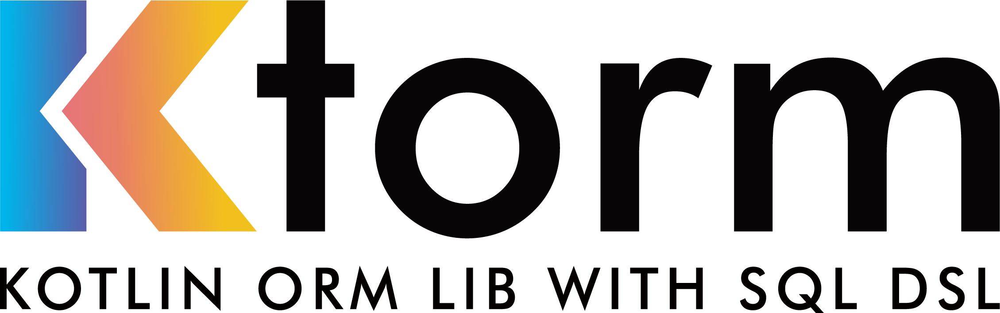

<p align="center">
    <a href="https://ktorm.liuwj.me">
        
    </a>
</p>
<p align="center">
    <a href="https://www.travis-ci.org/vincentlauvlwj/Ktorm">
        
    </a>
    <a href="https://search.maven.org/search?q=g:%22me.liuwj.ktorm%22">
        
    </a>
    <a href="https://bintray.com/vincentlauvlwj/maven">
        
    </a>
    <a href="LICENSE">
        
    </a>
    <a href="https://app.codacy.com/app/vincentlauvlwj/Ktorm?utm_source=github.com&utm_medium=referral&utm_content=vincentlauvlwj/Ktorm&utm_campaign=Badge_Grade_Dashboard">
        
    </a>
    <a href="https://www.liuwj.me">
        
    </a>
</p>

# Ktorm 是什么？

Ktorm 是一个直接基于纯 JDBC 编写的高效简洁的轻量级 Kotlin ORM 框架，它提供了强类型而且灵活的 SQL DSL（领域特定语言）和许多方便的扩展函数，以减少我们操作数据库的重复劳动。当然，所有的 SQL 都是自动生成的。查看更多详细文档，请前往官网：[https://ktorm.liuwj.me](https://ktorm.liuwj.me)。

:cn: 简体中文 | :us: [English](README.md)

# 特性

 - 没有配置文件、没有 xml、轻量级、简洁易用
 - 强类型 SQL DSL，将低级 bug 暴露在编译期
 - 灵活的查询，随心所欲地精确控制所生成的 SQL
 - 易扩展的设计，可以灵活编写扩展，支持更多数据类型和 SQL 函数等
 - 方言支持，MySQL、Oracle、PostgreSQL，你也可以自己编写方言支持，只需要实现 `SqlDialect` 接口即可

# 快速开始

Ktorm 已经发布到 maven 中央仓库和 jcenter，因此，如果你使用 maven 的话，只需要在 `pom.xml` 文件里面添加一个依赖： 

````xml
<dependency>
    <groupId>me.liuwj.ktorm</groupId>
    <artifactId>ktorm-core</artifactId>
    <version>${ktorm.version}</version>
</dependency>
````

或者 gradle： 

````groovy
compile "me.liuwj.ktorm:ktorm-core:${ktorm.version}"
````

然后，创建一个 Kotlin object，描述你的表结构： 

````kotlin
object Employees : Table<Nothing>("t_employee") {
    val id by int("id").primaryKey()
    val name by varchar("name")
    val job by varchar("job")
    val managerId by int("manager_id")
    val hireDate by date("hire_date")
    val salary by long("salary")
    val departmentId by int("department_id")
}
````

现在，可以编写代码连接数据库，执行一个简单的查询了：

````kotlin
fun main() {
    Database.connect("jdbc:mysql://localhost:3306/ktorm", driver = "com.mysql.jdbc.Driver")

    for (row in Employees.select()) {
        println(row[Employees.name])
    }
}
````

当你执行这个程序，Ktorm 就会生成一条 SQL `select * from t_employee`，查询表中所有的员工记录，然后打印出他们的名字。 

