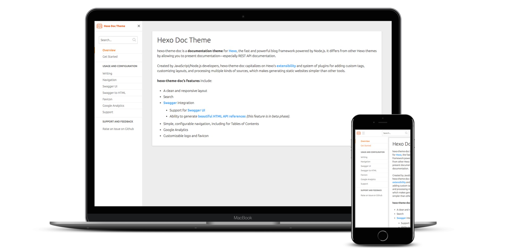

hexo-theme-doc
==============

[](https://opensource.org/licenses/MIT)
[](https://david-dm.org/zalando-incubator/hexo-theme-doc)
[](https://www.codacy.com/app/bhaskarmelkani/hexo-theme-doc)
[](https://www.codacy.com/app/bhaskarmelkani/hexo-theme-doc)
[](https://travis-ci.org/zalando-incubator/hexo-theme-doc)
[](https://badge.fury.io/js/hexo-theme-doc)

**LiveDemo:** [https://zalando-incubator.github.io/hexo-theme-doc](https://zalando-incubator.github.io/hexo-theme-doc)

hexo-theme-doc is a **documentation theme** for [Hexo](https://hexo.io/), the fast and powerful blog framework powered by Node.js. It differs from other Hexo themes by allowing you to present documentation—especially REST API documentation.

Created by JavaScript/Node.js developers, hexo-theme-doc capitalizes on Hexo's [extensibility](https://hexo.io/api/) and system of plugins for adding custom tags, customizing layouts, and processing multiple kinds of sources, which makes generating static websites simpler than other tools.

hexo-theme-doc's features include:

* A clean and responsive layout
* Search
* [Swagger](https://swagger.io/) integration
  * Support for [Swagger UI](https://zalando-incubator.github.io/hexo-theme-doc/usage-and-configuration/swagger-ui.html)
  * Ability to generate [beautiful HTML API references](https://zalando-incubator.github.io/hexo-theme-doc/usage-and-configuration/swagger-to-html.html) *(this feature is in beta phase)*.
* Simple, configurable navigation, including for Tables of Contents
* Google Analytics
* Customizable logo and favicon

Visit our **[demo](https://zalando-incubator.github.io/hexo-theme-doc)** to view an example of hexo-theme-doc in action.

[](https://zalando-incubator.github.io/hexo-theme-doc)

### Table of Contents

* [Get Started](#get-started)
* [Feature Roadmap](#feature-roadmap)
* [Contributing](#contributing)
* [Development](#development)
* [Credits](#credits)
* [License](#license)

## <a name="get-started"></a> Get Started

Our [step-by-step guide](https://zalando-incubator.github.io/hexo-theme-doc/get-started.html) aims to get you running with hexo-theme-doc in five minutes or less.

For a deeper dive, check our **[user documentation](https://zalando-incubator.github.io/hexo-theme-doc)**.

## <a name="feature-roadmap"></a> Feature Roadmap

hexo-theme-doc is currently in development at [Zalando](https://jobs.zalando.com/tech/) and useful out-of-the-box to others. We welcome suggestions/feedback and [contributions](./CONTRIBUTING.md), especially on these planned features:

* More sophisticated control over navigation/automatic filesystem-based navigation (**community feedback priority**)
* Swagger to HTML *(this feature is in beta phase)*
  * Make implementation more robust, and covering all edge cases (**development priority**)
  * Support for Swagger 3.0
  * Ability to fetch Swagger files from remote locations
  * Ability to provide request/response examples in an external file
  * Exclusion of APIs/operations from output
  * Markdown content support

For more info on our progress, visit the [changelog](./CHANGELOG.md) contributions.

## <a name="contributing"></a> Contributing

There are many ways to contribute to hexo-theme-doc:

* give a github star to the project
* create github issues and help us to find bugs and/or request features.
* contribute to the source code

Please check our [CONTRIBUTING](./CONTRIBUTING.md) guidelines.

## <a name="development"></a> Development

To get started with hexo-theme-doc **development**, you need to install [NodeJS](https://nodejs.org/en/) and [Git](https://git-scm.com/). Then install `hexo-cli` globally:

```
$ npm install hexo-cli -g
```

Get the theme source and install the dependencies:

```bash
$ git clone git@github.com:zalando-incubator/hexo-theme-doc.git
$ cd hexo-theme-doc && npm install
```

Ensure that you can successfully run test and linting tasks:

```
$ npm run test && npm run lint
```

If you want to update the visual aspects of your front-end, we suggest using our [user documentation](https://zalando-incubator.github.io/hexo-theme-doc) site as a playground for previewing your changes. First, [link](https://docs.npmjs.com/cli/link) the theme package globally with:

```
$ cd hexo-theme-doc && npm link
```

Then get the user documentation source:

```
$ git clone git@github.com:zalando-incubator/hexo-theme-doc.git hexo-theme-doc-site
$ cd hexo-theme-doc-site
$ git fetch --all && git checkout gh-pages-source
$ npm install
```

> The documentation source resides in this repository as well but just on a different branch called: `gh-pages-source`

Now [link](https://docs.npmjs.com/cli/link) the theme package as a dependency (this will use your local version):

```bash
$ npm link hexo-theme-doc
```

Finally run the built-in server:

```bash
$ hexo s
```

Open your browser at http://localhost:4000, and hopefully you'll see the documentation site up and running.

### Test

Run tests with Facebook's [Jest](https://facebook.github.io/jest/) (currently the only testing tool compatible with hexo-theme-doc):

```
$ npm run test
```

To generate coverage reports run:

```
$ npm run test:coverage
```

Reports are generated at `target/coverage`.Sometimes you'll only need to run one test suite focused on a single problem; do that by running:

```
$ npm run test -- <regexp>
```

`<regexp>` represents a Regular Expression, matching test file path(s)—eg. `npm run jest -- search*`.

### Lint

Lint the code using [ESLint](http://eslint.org/) (currently the only linting tool compatible with hexo-theme-doc):

```
$ npm run lint
```

To apply automatic fixes to your code, run it with the `--fix` option:

```
$ npm run lint --fix
```

### Compile

Use [Webpack](https://github.com/webpack/webpack) and [node-sass](https://github.com/sass/node-sass) to compile your JavaScript source and style source for the browser:

```
$ npm run compile
```

**!!! ALWAYS !!!** compile and commit distribution artifacts after updating Javascript and/or SCSS files.

### Release <small>(recommended workflow)</small>

Only the [maintainers](./MAINTAINERS)** perform releases. Our preferred workflow:

1. Bump version in `package.json`
2. Run `npm run prerelease`
3. Commit and push
4. Open a PR
5. When PR is merged, tag and push

## <a name="credits"></a> Credits

* Thanks to [Esin Isik](https://www.linkedin.com/in/esinis/) for helping us out with **Design** and **UX**
* Thanks to Royyan Razka from the Noun Project for the logo
* Some similar projects that inspired us: [hexo-theme-meteor](https://github.com/meteor/hexo-theme-meteor), [slate](https://github.com/lord/slate), [gitbook](https://github.com/GitbookIO/gitbook), [readthedocs theme](https://github.com/rtfd/sphinx_rtd_theme).

## <a name="license"></a> License

MIT license with exceptions. See the [full license](./LICENSE) for details.

Copyright 2017, Zalando SE

Permission is hereby granted, free of charge, to any person obtaining a copy of this software and associated documentation files (the "Software"), to deal in the Software without restriction, including without limitation the rights to use, copy, modify, merge, publish, distribute, sublicense, and/or sell copies of the Software, and to permit persons to whom the Software is furnished to do so, subject to the following conditions:

The above copyright notice and this permission notice shall be included in all copies or substantial portions of the Software.

THE SOFTWARE IS PROVIDED "AS IS", WITHOUT WARRANTY OF ANY KIND, EXPRESS OR IMPLIED, INCLUDING BUT NOT LIMITED TO THE WARRANTIES OF MERCHANTABILITY, FITNESS FOR A PARTICULAR PURPOSE AND NONINFRINGEMENT. IN NO EVENT SHALL THE AUTHORS OR COPYRIGHT HOLDERS BE LIABLE FOR ANY CLAIM, DAMAGES OR OTHER LIABILITY, WHETHER IN AN ACTION OF CONTRACT, TORT OR OTHERWISE, ARISING FROM, OUT OF OR IN CONNECTION WITH THE SOFTWARE OR THE USE OR OTHER DEALINGS IN THE SOFTWARE.
